# 🏗 FinFlow Architecture

This document discusses various aspects related to **architecture** for of **FinFlow** application — including **diagrams**, **layer descriptions**, **domain model**, **runtime flows**, **deployment architecture**, **cross-cutting concepts**, **quality goals**, **risks**, various **ADRs** and more.

# 🏛️ **FinFlow – arc42 Architecture Documentation**

*Version 1.0 — 2025*

# 1. Introduction and Goals 

FinFlow is a modern, stress-free **personal finance and budgeting desktop application** built using:

* **PyQt6** (UI)
* **SQLAlchemy 2.0 ORM** (Persistence)
* **PostgreSQL (Dockerized)** (Database)
* **Poetry** (Package & environment manager)
* **SOLID-based layered architecture**
* **GitHub Actions CI**

The goal is to provide:

* A reliable, consistent budgeting tool
* Extensible domain logic
* Clear separation of concerns
* Maintainable, testable code
* Local-first storage with future cloud-sync capability

# 2. Architecture Constraints 

### Technical Constraints

* Python ≥ 3.11
* PyQt6 for GUI (mandatory)
* PostgreSQL for storage
* Docker Compose must orchestrate DB lifecycle
* SQLAlchemy ORM + Alembic migrations
* Poetry for dependency management
* GitHub Actions for CI
* Should run on Windows, macOS, Linux

### Organizational Constraints

* Code must follow **SOLID principles**
* Domain logic must not depend on UI or infrastructure
* Repository/repo-pattern must encapsulate DB logic
* All modules must use absolute imports under package namespace `finflow.*`

# 3. System Scope and Context 

## 3.1 Overall System Architecture (C4 Level 1)

```mermaid
%%{init: {'theme': 'neutral', 'themeVariables': {
  'primaryColor': '#f2f2f2',
  'edgeLabelBackground':'#e6ffe6',
  'actorBorder':'#000000'
}}}%%
graph TD
UI[PyQt6 GUI]
Controller[Application Controller]
Service[Domain Services]
Repo[Repository Layer]
ORM[SQLAlchemy ORM Models]
DB[(PostgreSQL DB via Docker)]

UI --> Controller --> Service --> Repo --> ORM --> DB

FinFlow allows users to:

* Track income, expenses, transfers
* View charts for monthly allocations
* Export/import data
* Maintain a clean personal budget

## 3.2 Technical Context

```mermaid
%%{init: {'theme': 'neutral', 'themeVariables': {
  'primaryColor': '#f2f2f2',
  'edgeLabelBackground':'#e6ffe6',
  'actorBorder':'#000000'
}}}%%
flowchart LR
    user((User))

    subgraph Desktop["User Machine"]
        app["FinFlow Desktop App (PyQt6)"]
        subgraph finflow["FinFlow Layers"]
            ui["UI / Views (PyQt6)"]
            controller["Controllers"]
            domain["Domain Services"]
            infra["Infrastructure (ORM + Repos)"]
        end
    end

    db[("PostgreSQL (Docker Container)")]
    ci[GitHub Actions CI Pipeline]

    user --> app
    app --> ui
    ui --> controller
    controller --> domain
    domain --> infra
    infra --> db

    ci --> GitHubRepo
    ci --> db
```

# 4. Development View 

## 4.1. Layered Architecture Diagram

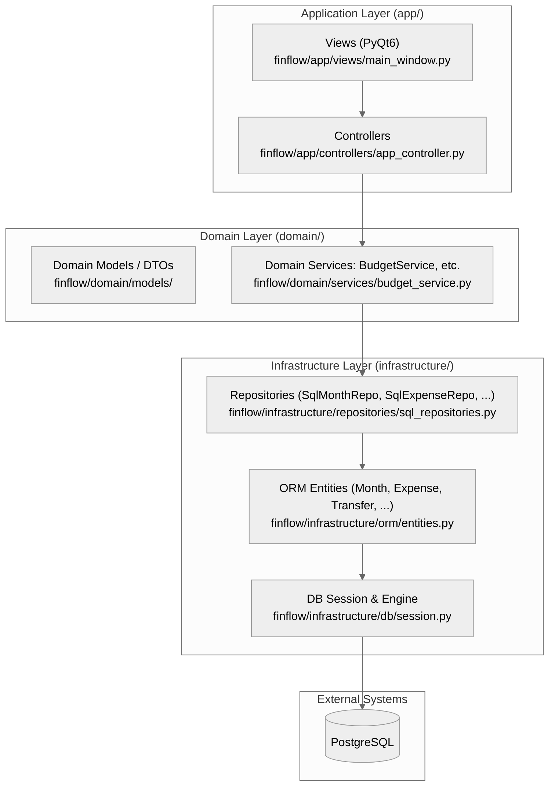

## 4.2. Entity / Data Model Diagram (`entities.py`)

This shows various **entities** that are defined for `Month`, `Expense`, `Transfer`, `SavingsGoal`, and `NetWorth`; and how they relate to each other.

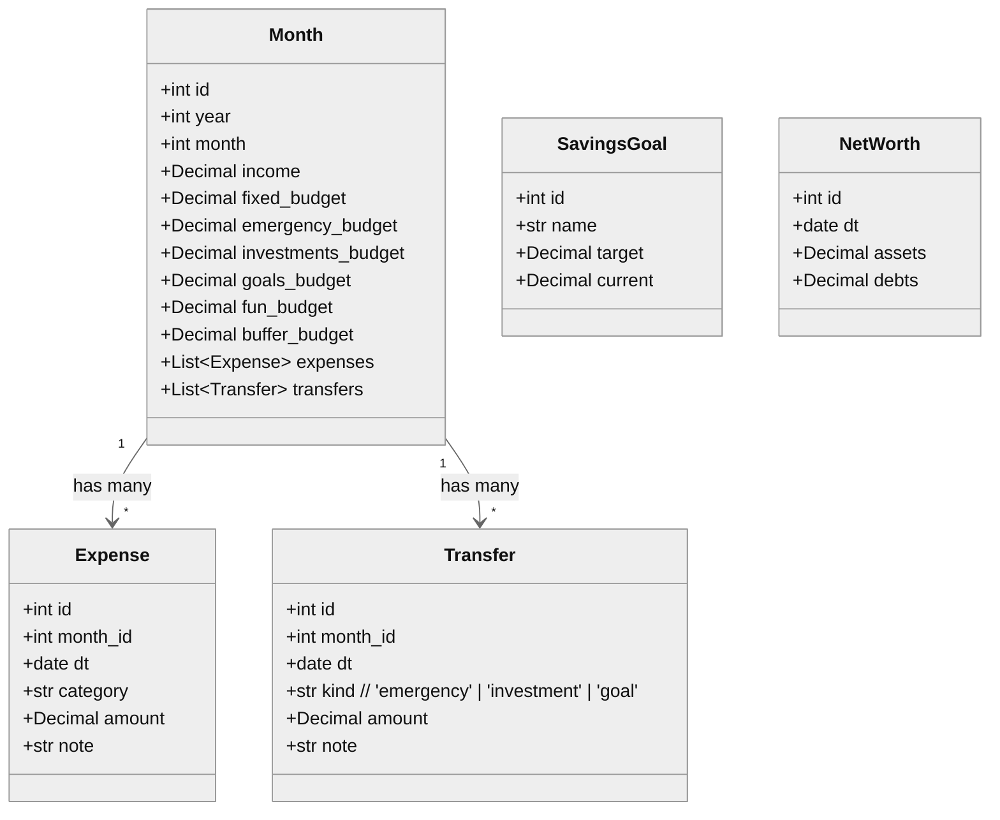

## 4.3. Component Diagram Inside Backend (Services + Repos)

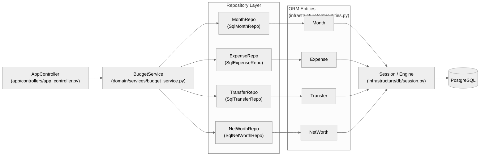

## 4.4. Sequence Diagram — Add a New Expense

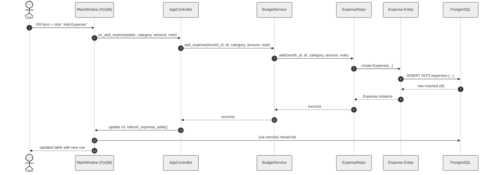

## 4.5. Sequence Diagram — Import Expenses from CSV

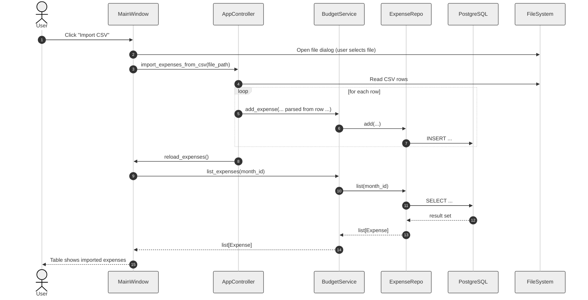

## 4.6. Sequence Diagram — Save or Update Month Budget

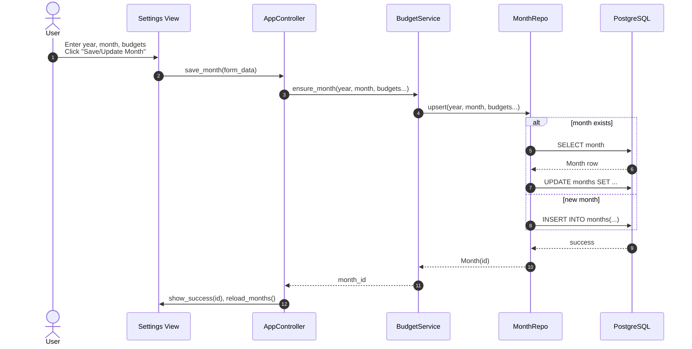

## 4.7. Sequence Diagram — Net Worth Snapshot

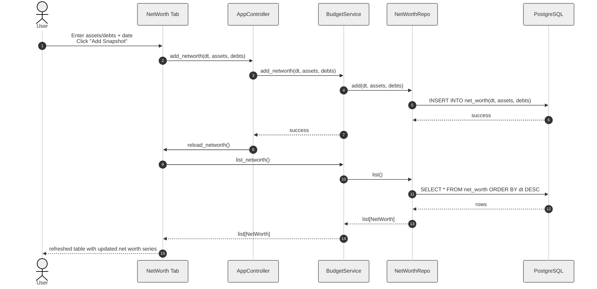

# 5. Deployment View

## 5.1 Local Deployment (Desktop)

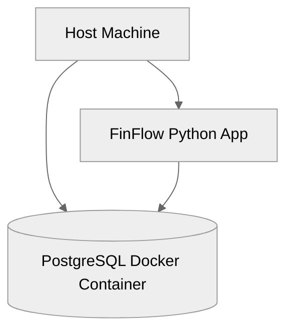

* App runs as a native Python process
* Database runs isolated inside a Docker container
* Both communicate over localhost port 5432

## 5.2. Deployment / Runtime Diagram (Local + Docker + CI)

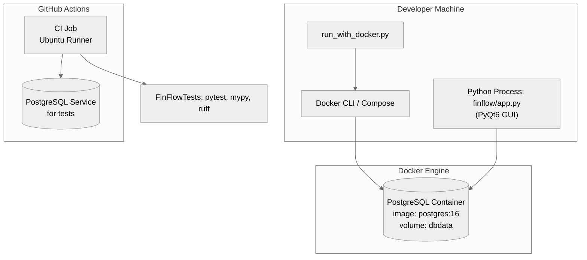

## 5.3. Sequence Diagram — App Startup with Docker

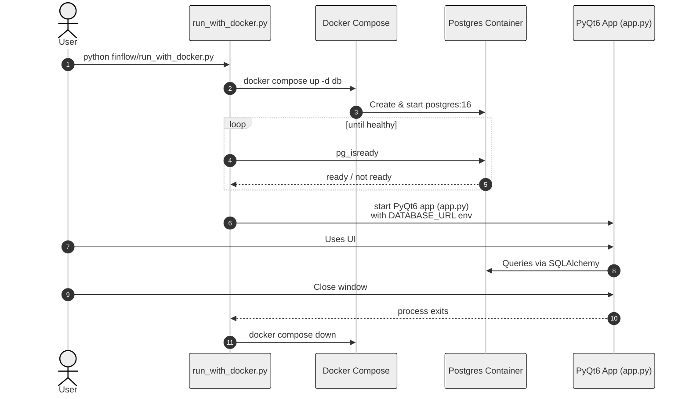

## 5.3. Sequence Diagram — CI Pipeline Run (GitHub Actions)

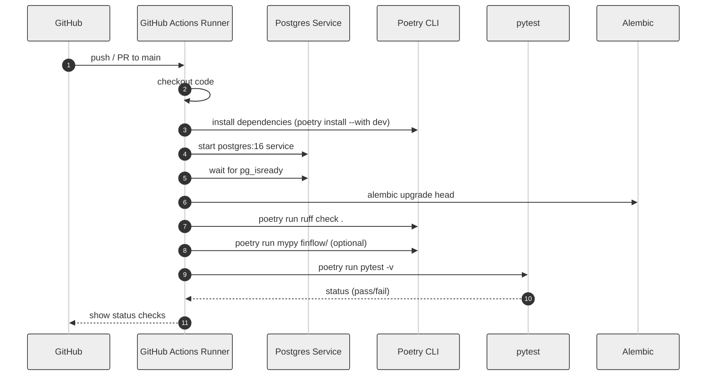

# 6. Cross-cutting Concepts 

### 6.1 Configuration

* `settings.py` loads from `.env`
* Environment variables (DB_URL, DEBUG…)
* Use `python-dotenv`

### 6.2 Persistence

* SQLAlchemy ORM
* Repositories expose pure Python interfaces
* Alembic handles schema evolution

### 6.3 UI Design Principles

* Separation between view and logic
* Controllers only connect signals/slots
* No DB calls inside UI classes

### 6.4 Error Handling

* Domain services raise domain exceptions
* UI shows friendly dialogs
* Logging via Python `logging` module

### 6.5 Security

* No secrets committed in Git
* `.env` excluded via `.gitignore`
* Database only listens on localhost

# 7. Architecture Decisions (ADR) 

All architecture decisions record are stored under [adr/](adr) folder
These ADRs discusses all major architectural choices around:

* Backend
* Frontend
* CI
* DevOps
* Persistence
* Services
* Controllers
* App structure
* Build + Release

# 8. Quality Requirements 

The complete, detailed Quality Requirements specification is available in the separate document on [quality_requirements](8_quality_requirements.md)

# 9. Risks and Technical Debt

For the complete breakdown—including
 - identified risks,
 - probability & impact scoring,
 - mitigation strategies,
 - debt backlog, and
 - dependency-related risks

please refer to: [Technical risk catalog and debt register](9_risks_and_technical_debt.md)

# 10. Testing Strategy

FinFlow uses a layered testing approach (unit, integration, and GUI tests) to ensure reliability across the domain, infrastructure, and PyQt layers.
For full details, refer to: [testing_strategy.md](10_testing_strategy.md)

# 11. Glossary 

| Term | Meaning                      |
| ---- | ---------------------------- |
| DTO  | Data Transfer Object         |
| ORM  | Object Relational Mapper     |
| CRUD | Create, Read, Update, Delete |
| ADR  | Architecture Decision Record |
| CI   | Continuous Integration       |


