# 12. Quality Requirements — FinFlow (Arc42 Section 12)
It includes **quality goals, scenarios, metrics, priorities, and constraints**.

## 12.1 Quality Goals (Top 5)

These represent the most important quality attributes for FinFlow:

### 1. Maintainability (Top Priority)

The system must be easy to extend (new features), refactor, and test.
**Why?** FinFlow follows a clean, layered architecture (Domain, Infrastructure, App/UI), ensuring future growth.

### 2. Reliability

The application must handle DB connectivity, Docker orchestration, and user operations without data loss or crashing.

### 3. Usability

UI should be intuitive, clear, and require minimal training.
Budgeting is stressful for many users — the system must reduce cognitive load.

### 4. Performance

The app should load UI instantly and database operations (queries, inserts) must execute efficiently.

### 5. Security

FinFlow handles financial data; thus, secure defaults and safe data-handling are critical.

## 12.2 Quality Scenarios (ISO 25010-Aligned)

Quality scenarios help verify that the architecture supports the required attributes.

### Maintainability Scenarios

| Scenario | Description                                             | Requirement                                                                                 |
| -------- | ------------------------------------------------------- | ------------------------------------------------------------------------------------------- |
| **M1**   | Developer adds a new entity (e.g., “Recurring Expense”) | Should require touching only **Domain → ORM → Repo → View** layers, without breaking others |
| **M2**   | UI theme changes                                        | Changing QSS files must not require modifying controller logic                              |
| **M3**   | Adding new export format (XML/Excel)                    | Should not require DB changes, only service/util code                                       |

### Reliability Scenarios

| Scenario | Description                                            | Requirement                                                                 |
| -------- | ------------------------------------------------------ | --------------------------------------------------------------------------- |
| **R1**   | PostgreSQL container takes longer to start             | App must wait until DB is ready (already implemented in run_with_docker.py) |
| **R2**   | DB connection drops                                    | Reconnection should occur automatically via SQLAlchemy engine pooling       |
| **R3**   | Unhandled user action (clicking quickly, empty fields) | No crashes; UI validation must prevent invalid operations                   |

### Usability Scenarios

| Scenario | Description                              | Requirement                                                             |
| -------- | ---------------------------------------- | ----------------------------------------------------------------------- |
| **U1**   | First-time user interacts with dashboard | They must understand navigation without documentation                   |
| **U2**   | User enters invalid data                 | UI must communicate errors clearly without blocking the entire workflow |

### Performance Scenarios

| Scenario | Description                      | Requirement                                                 |
| -------- | -------------------------------- | ----------------------------------------------------------- |
| **P1**   | App startup time                 | UI must render in **< 1 second** after calling `app.exec()` |
| **P2**   | Expense list with 10,000 entries | Scrolling should remain smooth (~60 FPS)                    |
| **P3**   | Database query performance       | Typical query must resolve in **< 100 ms**                  |

### Security Scenarios

| Scenario | Description              | Requirement                                                                 |
| -------- | ------------------------ | --------------------------------------------------------------------------- |
| **S1**   | Accessing .env secrets   | Secrets must be excluded from Git (`.gitignore` already supports this)      |
| **S2**   | Exporting financial data | CSV/JSON files must be stored only on the user’s machine, no cloud transfer |
| **S3**   | SQL injection            | Prevented fully by SQLAlchemy ORM and parameterized queries                 |

## 12.3 Quality Requirements by Attribute (ISO 25010)

### Functionality

* Consistent, accurate data handling
* Correctness validated via unit tests + integration tests
* ORM constraints mirror domain rules

### Performance Efficiency

* Lightweight PyQt rendering
* Query optimization via SQLAlchemy relationship loading strategies
* PostgreSQL indexes on frequently queried fields
  (e.g., date, category, amount)

**Scenario P1: Large expense dataset**

* *Stimulus*: User has ~10,000 expenses spanning 5 years.
* *Response*: Loading overview and charts remains responsive.
* *Measures*:

  * Loading a month’s expenses table: < 1 second.
  * Pie chart rendering: < 2 seconds on average hardware.

**Scenario P2: Concurrent operations**

* *Stimulus*: User imports a CSV while also adding a manual expense.
* *Response*: No data loss; operations complete sequentially in the UI thread.
* *Measures*:

  * No corrupted rows.
  * If conflict occurs, user is informed, and operation can be retried.

### Compatibility

* Runs on macOS, Windows, Linux
* Python version: **3.11+
* Requires Docker Compose v2 → Guaranteed reproducible DB

### Usability

* Clean UI (tabs, icons, QSS theme)
* Accessibility: Keyboard shortcuts, larger fonts, dark/light mode
* Responsive layout using Qt layout managers

**Scenario U1: First-time user setup**

* *Stimulus*: A new user with basic technical skills runs the app.
* *Response*: They can install dependencies (Poetry + Docker), start the
  app, and create their first budget within **15–20 minutes**, using only
  the README and setup guide.
* *Measures*:

  * Steps documented clearly.
  * No manual SQL commands required.
  * Setup script and `SETUP_WITH_POETRY.md` are up to date.

**Scenario U2: Daily usage**

* *Stimulus*: User opens app and wants to log a new expense.
* *Response*: They can add an expense and see it reflected in overview and charts
  within **5 seconds** of app start.
* *Measures*:

  * Time from app start to “expense added and visible” ≤ 5 seconds on a
    typical laptop.
  * No unnecessary dialog friction.

### Reliability

* DB readiness & reconnection logic
* Safe transaction patterns via `session_scope()`
* Persistent Docker volume for data durability

**Scenario R1: DB unavailable at startup**

* *Stimulus*: User starts FinFlow but PostgreSQL container fails.
* *Response*: Application shows a clear error message and exits gracefully.
* *Measures*:

  * No stack trace shown to end-user.
  * Exit code ≠ 0, log entry written.

**Scenario R2: CSV import error**

* *Stimulus*: User imports a CSV with missing or invalid columns.
* *Response*: Application:

  * Validates CSV headers.
  * Reports rows that failed to import.
* *Measures*:

  * App remains usable.
  * At least partial import (for valid rows) is possible, or full rollback
    is clearly communicated.

### Security

* Secrets in `.env`
* Proper OS file permissions
* No use of dangerous Python `eval()` or raw SQL strings

**Scenario S1: Database credentials**

* *Stimulus*: User installs app on shared machine.
* *Response*: Credentials are not hard-coded in the repo.
* *Measures*:

  * No passwords committed to Git.
  * `.env` is gitignored and `.env.example` provided.

**Scenario S2: Data backup**

* *Stimulus*: User backs up system or Docker volumes.
* *Response*: Backups contain DB data; access to these backups should be
  governed by OS-level policies.
* *Measures*:

  * Clear messaging in docs about backup behavior.
  * Recommendation for full-disk encryption for sensitive use cases.

### Maintainability

* Layered architecture: app → domain → infrastructure
* Repositories decouple DB from business logic
* Every layer has isolated tests

**Scenario M1: Add a new savings type**

* *Stimulus*: Developer wants to add a new transfer kind (e.g. “charity”).
* *Response*: Changes are localized to:

  * ORM entity (`Transfer.kind` constraint)
  * Repository constants
  * Domain service (enum/value)
  * UI (new tab or filter)
* *Measures*:

  * ≤ 4 files changed.
  * Test suite updated with minimal effort.
  * No changes required to core DB session or other unrelated modules.

**Scenario M2: Library upgrade**

* *Stimulus*: SQLAlchemy minor version upgrade.
* *Response*: Running CI on the PR should detect any breakage.
* *Measures*:

  * CI pipeline runs < 10 minutes.
  * If tests pass, probability of runtime regression is low.

### Portability

* Poetry ensures dependency reproducibility
* Dockerized database ensures consistent setup
* App can run in a venv or system Python

**Scenario Port1: Cross-platform execution**

* *Stimulus*: Developer runs the app on Windows, macOS, Linux.
* *Response*: Same steps:

  * `poetry install`
  * `docker compose up -d`
  * `poetry run python finflow/run_with_docker.py`
* *Measures*:

  * No OS-specific code in main application modules.
  * CI can at least validate Linux; optional macOS/Windows runners later.

## 12.4 Quality Tree (Hierarchical Breakdown)

```mermaid
flowchart TD

Quality["Quality Goals"]
Quality --> Q1[Usability]
Quality --> Maintainability
Quality --> Reliability
Quality --> Usability
Quality --> Performance
Quality --> Security
Quality --> Portability

Q1 --> Q1a[Simple onboarding]
Q1 --> Q1b[Clear visual layout]
Q1 --> Q1c[Keyboard navigation]

Maintainability --> M1["Layered Architecture"]
Maintainability --> M2["Clear Boundaries (UI / Domain / Infra / App)"]
Maintainability --> M3["Testability"]

Reliability --> R1["Stable DB Connections"]
Reliability --> R2["Docker Lifecycle Control"]
Reliability --> R3["Error Handling & Validation"]

Usability --> U1["UI Clarity & Simplicity"]
Usability --> U2["Input Validation"]
Usability --> U3["Visual Feedback"]

Performance --> P1["Fast Startup"]
Performance --> P2["Efficient Queries"]
Performance --> P3["Smooth Rendering"]

Security --> S1["Credentials Protection"]
Security --> S2["ORM Safety"]
Security --> S3["Local Data-Only"]

Portability --> Q6a[Runs on Win/macOS/Linux]
Portability --> Q6b[Easy setup via Poetry + Docker]
```

## 12.5 Metrics & Benchmarks

| Attribute       | Metric                | Target                             |
| --------------- | --------------------- | ---------------------------------- |
| Maintainability | Cyclomatic complexity | < 10 for services & controllers    |
| Performance     | Startup time          | < 1 second                         |
| Reliability     | Crash rate            | < 0.1%                             |
| Usability       | Click precision       | > 95% tasks completed on first try |
| Security        | Secret exposure       | 0 `.env` committed ever            |
| Testability     | Coverage              | > 70% (domain + repos)             |

## 12.6 Quality Constraints

### Technical

* Python versions older than 3.11 not supported
* Qt Designer `.ui` files must be avoided unless managed properly
* PostgreSQL must run via Docker Compose

### Organizational

* Minimal dev onboarding time (< 20 minutes)
* Documentation must stay centralized in `/docs`
