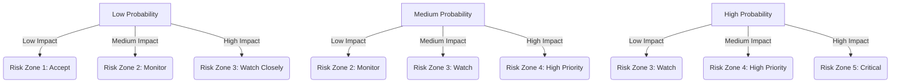

# 9. Risks & Technical Debt — FinFlow Architecture Documentation

This chapter identifies major risks, their impact, probability, mitigation strategies, and the current known technical debts in the FinFlow application.

# 9.1 Top Project Risks (Risk List)

The following risks are categorized using common software architecture risk groups:

| ID      | Risk      | Description         | Impact   | Probability | Mitigation   |
| ------- | --------- | ------------------- | -------- | ----------- | ------------ |
| **R01** | **Database Container Startup Failure**     | Docker/PostgreSQL may fail to start or become unhealthy, causing the app to hang. | High     | Medium      | - Health checks in Docker Compose,  - Retry logic in `run_with_docker.py`,  - Fail-fast + clear message to user.  |
| **R02** | **SQLAlchemy Migration Inconsistency**     | If ORM models in `entities.py` change but migrations are not updated, conflicts occur.  | High     | Medium      | Mandatory schema migration workflow(Enforce Alembic migration per model change),  CI pipeline checks migrations on PRs.         |
| **R03** | **GUI freezing due to blocking long-running operations**              | Long-running DB operations can freeze the GUI (single-threaded).                  | High     | High        | Use QThread or asyncio-style background workers for heavy tasks.        |
| **R04** | **Poor Error Handling & Crash Reports**    | Lack of centralized error logging can cause silent failures.                      | Medium   | High        | Add logging framework, structured logs, exception handlers.             |
| **R05** | **Import/Export Data Integrity**           | Incorrect CSV/JSON structure can break app or lose user data.                     | High     | Low         | Use schema validation + transaction rollbacks, - Strict schema for imports, - Temporary-files + atomic swap.                |
| **R06** | **Scaling Beyond Single User**             | Architecture is local-first; multi-user or cloud sync will require redesign.      | High     | Medium      | Modularize repository layer, keep domain pure to enable cloud backends. |
| **R07** | **Chart Rendering Performance**            | Matplotlib can get slow with large data sets.                                     | Medium   | Low         | Lazy-load charts, use caching, or migrate to PyQtGraph if needed.       |
| **R08** | **Lack of End-to-End Tests**               | Large UI + DB workflow untested in CI might break releases.                       | High     | Medium      | Add integration tests using pytest-qt + dockerized DB.                  |
| **R09** | **Secrets in `.env`**                      | If `.env` is committed accidentally, DB credentials leak.                         | Critical | Low         | `.gitignore` includes `.env`. Use `.env.example` pattern.               |
| **R10** | **Incomplete Domain Boundary Enforcement** | UI may accidentally access DB directly if not enforced.                           | Medium   | Medium      | Use dependency inversion, typed interfaces, review code regularly.      |
| **R11** | **Docker Desktop End-User Dependency**              | Users must have Docker installed; some systems (Windows Home, corporate machines) may block it.               | High     | High        | Optional fallback to local Postgres installation, - Provide an embedded database option (SQLite) in “offline/local mode”, - Add `DATABASE_MODE=local\|docker\|remote` toggle.      |
| **R12** | **Low Test Coverage in Domain Layer**              | Domain logic (budget calculations, validation, aggregates) may not be tested. | High     | High        | Test-driven approach on the domain layer,  Run tests on CI using GitHub Actions |
| **R13** | **Database Schema Evolution Breaks App**              | Schema changes (new columns, constraints) might break older app versions or migrations, leading to startup failures or data inconsistencies. | High     | High        | [See here](#r13--database-schema-evolution-breaks-app) |
| **R14** | **Concurrency / data loss with multi-instance usage**              | Running multiple instances of FinFlow pointing at the same database may cause overwrites or conflicting updates.  | High     | High        | [See here](#r14--concurrency--data-loss-in-multi-instance-usage) |
| **R15** | **Lack of Automated UI Tests**              | Currently most tests are at domain/infrastructure levels only. Changes to the PyQt6 UI risk regressions in signals/slots, layouts, and workflows. | High     | High        | [See here](#r15--lack-of-automated-ui-tests) |

### R13 – Database Schema Evolution Breaks App

**Description**  
Schema changes (new columns, constraints) might break older app versions or
migrations, leading to startup failures or data inconsistencies.

**Causes**
- Manual schema changes in PostgreSQL without Alembic
- Uncoordinated model changes in `infrastructure/orm/entities.py`
- Multiple versions of the app using the same DB

**Mitigation**
- Use **Alembic** migrations consistently for every schema change.
- Enforce a rule: **no direct DB changes** outside migrations.
- Add migration execution to CI for `finflow_test` DB.
- Add versioning info to the DB (e.g. `schema_version` table).

**Contingency**
- Maintain backup scripts for the `dbdata` volume.
- Provide rollback migration or export/import scripts.

### R14 – Concurrency / Data Loss in Multi-Instance Usage

**Description**  
Running multiple instances of FinFlow pointing at the same database may cause
overwrites or conflicting updates.

**Mitigation**
- Document officially: “FinFlow is **single-user / single-instance** for now.”
- Use transactions and `session_scope()` for all writes.
- Later: consider optimistic locking (version column) on critical tables.

### R15 – Lack of Automated UI Tests

**Description**  
Currently most tests are at domain/infrastructure levels only. Changes to the
PyQt6 UI risk regressions in signals/slots, layouts, and workflows.

**Mitigation**
- Introduce **pytest-qt** for basic smoke tests:
  - Main window can open and close
  - Key flows (add expense, add transfer, refresh charts) work.
- Adopt a **manual UI regression checklist** until automated coverage improves.

**Remediation Plan**
- Start with small UI tests for critical workflows.
- Add UI tests to CI (optional job due to GUI overhead).

---

# 9.2 Technical Debt Register

This section tracks areas that need refinement in future development cycles.

| ID       | Technical Debt        | Description         | Impact | Planned Fix Version | Mitigation   |
| -------- | --------------------- | ------------------- | ------ | ------------------- | ------------ |
| **TD01** | **Monolithic Controller**              | Controllers may become “God objects” handling UI logic and business rules. | Medium | v1.2                | - Strict MVC enforcement, - Keep views “dumb”: UI renders only, - Move logic inside domain services
| **TD02** | **Minimal Repository Interfaces**      | Repositories currently tightly coupled to SQLAlchemy Session.                         | Medium | v1.3                | Introduce:`IBudgetRepository`, `IExpenseRepository`, `ITransferRepository` with SQLAlchemy implementations.
| **TD03** | **Tight Coupling Between UI & Domain** | Some UI components still call services synchronously.                                 | Medium | v1.2                |
| **TD04** | **Missing DTO Layer**                  | Domain ↔ UI mapping not fully explicit.                                               | Low    | v1.4                |
| **TD05** | **No Theming System for PyQt6**        | Styling is inline; should be moved to QSS + themes.                                   | Low    | v1.3                | - Scalable QSS themes
| **TD06** | **Accessibility Issues**        | Font size, contrast, keyboard accessibility not fully implemented.  | Low    | v1.3                | - Dark mode / high contrast theme, - Keyboard shortcuts
| **TD076** | **Poor Test Coverage**                 | Unit tests exist but integration tests are missing.                                   | High   | v1.1                |
| **TD08** | **Manual Dependency Injection**        | No DI framework used; passing dependencies manually.                                  | Medium | v1.2                |
| **TD09** | **Import/Export Format Hardcoded**     | CSV/JSON logic resides in utils, not strategy pattern.                                | Low    | v1.4                |
| **TD10** | **Logging Deficiencies**               | Minimal logging makes debugging difficult.                                         | Medium | v1.1                | - Add structured JSON logs, - Log to file + rotating handler
| **TD11** | **Inconsistent Logging**               | No centralized logging config for app and DB.                                         | Medium | v1.1                |
| **TD12** | **Large Database Startup Script**      | `run_with_docker.py` mixes concerns: process control + health-checks.                 | Medium | v1.2                |
| **TD13** | **Low Test Coverage in Domain Layer**              | Domain logic (budget calculations, validation, aggregates) may not be tested. | High     | -        | Test-driven approach on the domain layer,  Run tests on CI using GitHub Actions |
| **TD14** | **Connection Pool & Timeout Misconfigurations**              | | High     | -        | Configure SQLAlchemy pool size, - Idle timeout, - Retry mechanism |
| **TD15** | **Performance Bottlenecks for Large Data Sets**              | Future features such as multi-year expense history could degrade performance. | High     | -        |  Add SQL indices, - Server-side pagination, - Efficient queries
| **TD16** | **User Input Validation Risk**              | Improper validation may cause logical inconsistencies. | High     | -        | - Services validate data before DB write, - Reusable validators |
| **TD17** | **Charts Logic Embedded in Controller**              | Charts generated in the UI layer. | Medium     | -        |  Extract chart logic into: `finflow/domain/services/chart_service.py` |
| **TD18** | **Alembic Not Fully Automated**              | Migrations still require manual steps. | High     | -        |  - Add CI check that runs: alembic --autogenerate --check, - Block PR if schema drift is detected
| **TD19** | **No Plugin System**              | Features currently require code changes. | Medium     | -        | Introduce extension/plugin architecture. |
| **TD** | **UI tightly coupled to Qt widgets**              | Harder to move to web or mobile | High     | High        | Gradually extract presenter/viewmodel logic |
| **TD** | **No configuration UI**              | Users must edit `.env` manually | High     | High        | Add simple settings dialog in PyQt6 |

# 9.3 Risk Matrix (Probability × Impact)

### Mermaid Diagram

(Use directly in Arc42 documentation)

Map your risks:

| Risk                     | Matrix Position                         |
| ------------------------ | --------------------------------------- |
| R01 (DB Startup Issues)  | High Probability × High Impact → **C3** |
| R02 (Migration Drift)    | Medium Prob × High Impact → **B3**      |
| R03 (UI Blocking)        | High Prob × High Impact → **C3**        |
| R04 (Error Logging)      | Medium Prob × Medium Impact → **B2**    |
| R08 (Test Coverage Gaps) | Medium Prob × High Impact → **B3**      |

# 9.4 Architectural Risks

### A. Layer Gap Risk

**Risk:** UI may accidentally bypass Controller/Service and jump to DB.
**Why it matters:** Breaks layers, harms maintainability.
**Mitigation:**

* Interface-based access
* Enforce domain-driven boundaries
* CI-level architecture tests (e.g., `pytest-arch`)

### B. Performance Risk (Charts + ORM)

**Risk:** Large datasets cause slow rendering & heavy DB queries.
**Mitigation:**

* ORM-level pagination
* View-model caching
* Asynchronous chart updates

### C. Docker Lifecycle Risk

If Docker fails, app fails.

Mitigation:

* Dedicated error UI for DB errors
* Offline/local mode fallback
* Automatic retries + backoff
* Logging container startup diagnostics

### D. Database Schema Evolution Risk

Schema changes may break import/export or old user databases.

Mitigation:

* Backwards-compatible migrations
* Pre-migration backup script
* Migration smoke tests in CI

# 9.5 Organizational Risks

| Area            | Risk                                           | Impact |
| --------------- | ---------------------------------------------- | ------ |
| Knowledge       | Only few contributors know entire architecture | High   |
| Release Process | No automated packaging or installers           | Medium |
| Dev Onboarding  | Complex setup (Poetry, Docker, PyQt)           | Medium |

Mitigation:

* Improve onboarding docs
* Add packaging workflow (PyInstaller)
* Developer walkthrough videos

# 9.6 Future Risks (Long-Term)

| Risk                  | Description                                                                       |
| --------------------- | --------------------------------------------------------------------------------- |
| Cloud Sync Complexity | If FinFlow moves to cloud sync, architecture must support multi-user concurrency. |
| Mobile Adaptation     | PyQt6 Android/iOS support would require major restructuring.                      |
| Plugin System         | Adding extensibility will require stable domain boundaries.                       |
| Multi-currency        | Domain layer must support conversions, historic FX, rounding rules.               |

## 9.7 Monitoring & Review

- Revisit this document **each minor release**.
- Add new risks when:
  - Tech stack changes
  - New features introduce external dependencies
  - Deployment model changes (e.g. cloud sync)

# 9.8 Summary

* Major high-impact risks revolve around:
  **DB orchestration**, **UI responsiveness**, **schema drift**, and **testing gaps**.
* Technical debt is manageable and mostly related to:
  **architecture refinement**, **modularity**, **UI & domain separation**, and **tooling consistency**.
* Mitigation plans exist for all major risks and are scheduled across versions.

